✦ ────────────────────────── ✦

## 🌾 about me

I build gentle little systems out of models, sensors, and code — turns out detection models and fairy lights aren't so different, they both just want to notice things.

- 🔍 currently exploring **AI / ML detection models**
- 🌱 tinkering with **IoT & embedded systems**
- 🕸️ building things for the **web**
- 🔐 poking around **cybersecurity**
- 🧵 favorite palette: earth tones + a little bit of dreamy fairy dust

✦ ────────────────────────── ✦

## 🧸 tech & tools

*(ganti badge di atas sesuai stack asli kamu — cari nama tool-nya di [shields.io](https://shields.io) dan [simpleicons.org](https://simpleicons.org) buat logo lain)*

✦ ────────────────────────── ✦

## 🐍 contribution snake

> ✦ ini animasi ular yang "memakan" kotak kontribusi kamu — gerak beneran tiap ada commit baru. Cara aktifin (sekali setup, otomatis jalan terus):
> 1. Di repo profil kamu, buat file `.github/workflows/snake.yml`
> 2. Isi dengan action [`Platane/snk`](https://github.com/Platane/snk) (tinggal copy contoh workflow dari repo itu)
> 3. Jalankan workflow-nya sekali (Actions tab → Run workflow), nanti file SVG animasinya otomatis ke-generate ke branch `output`
> 4. Ganti `YOUR_USERNAME` di atas dengan username GitHub kamu

✦ ────────────────────────── ✦

## 🌤️ github stats

*(ganti `YOUR_USERNAME` dengan username GitHub kamu)*

✦ ────────────────────────── ✦

## 🌙 let's build something gentle together

✦ made with care, 2026 ✦

